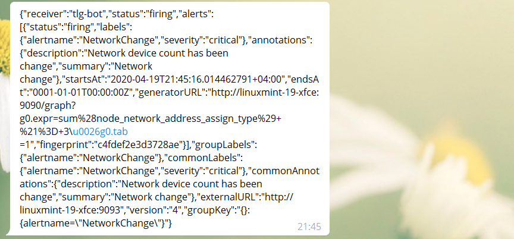
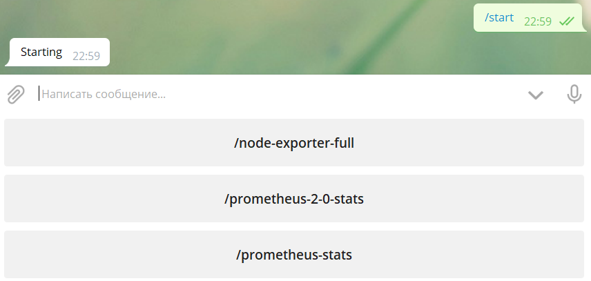
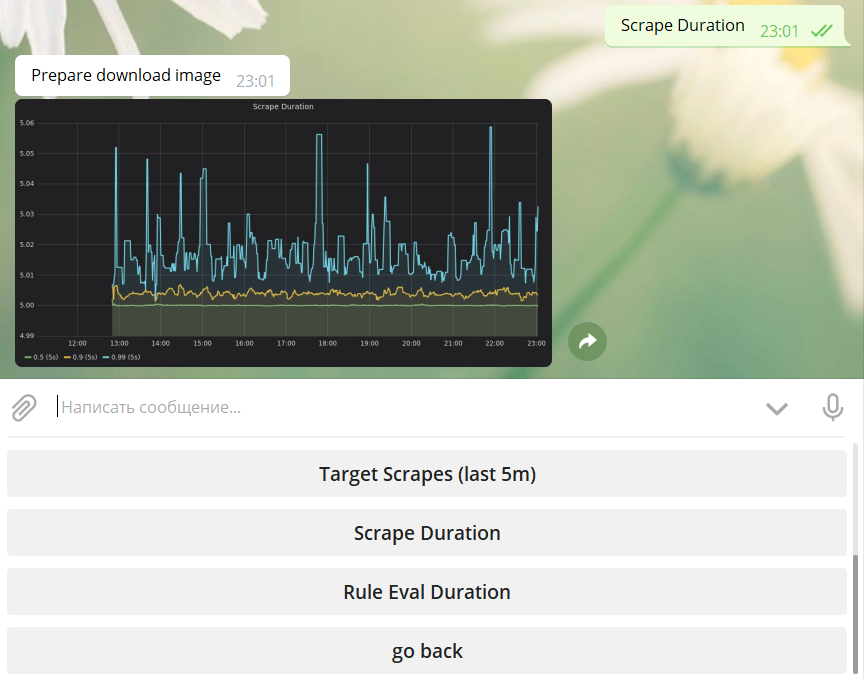
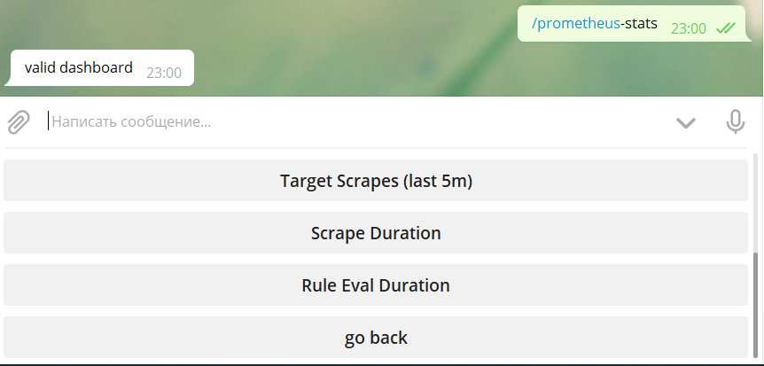
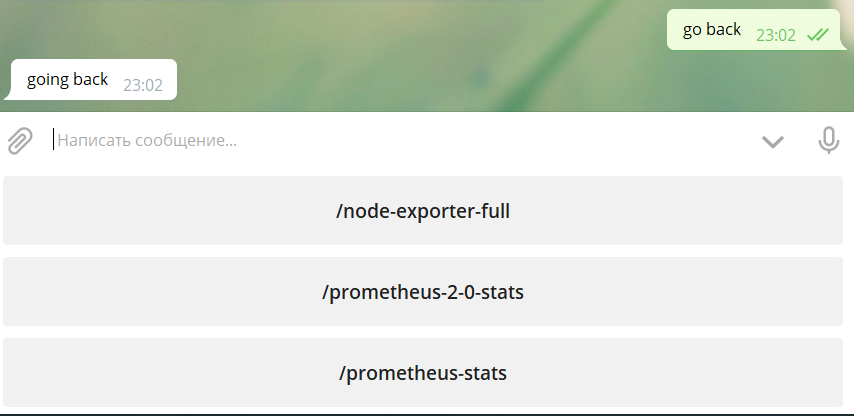
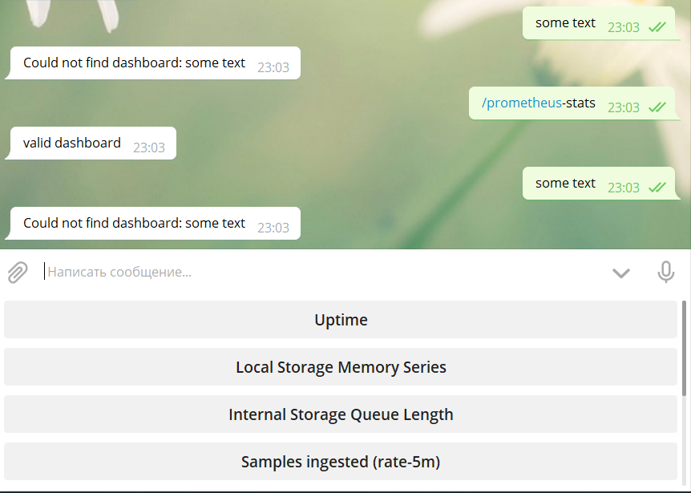

# prometheus-telegram

**prometheus-telegram** - бот для расширения возможностей системы Prometheus по оповещению пользователей о наступлении аварийных событий.

Бот выполняет две задачи:

1. Присылает оповещения об аварийных сообщениях из Prometheus пользователям в Telegram.

2. Так как зачастую в качестве дашборда к Prometheus настраивается Grafana, 
бот дает возможность пользователю загружать скриншоты конкретных графиков из Grafana. 
Это позволяет удаленно получить визуализацию интересующих метрик.

## Требования

1. Операционная система Linux (работоспособность проверялась на CentOS и Ubuntu)

2. Python3

3. Установленные модули из файла requirements.txt

4. Наличие сконфигурированного Alertmanager:

```yml
receivers:
  - name: 'tlg-bot'
    webhook_configs:
      - url: 'http://127.0.0.1:8080/'
        send_resolved: true
```

Бот настраивается конфигурационным файлом. По умолчанию в main.py указан:

     DEFAULT_CONFIG = './default_config'

default_config не добавлен в репозиторий, поскольку содержит реальные значения ключей и токенов. 
Вместо него в качестве примера присутствует **exhample_config**.
Перед запуском бота необходимо составить корректный конфигурационный файл. Его необходимо будет указать через опцию -с (см. пункт Использование) или прописать вместо DEFAULT_CONFIG в main.py
В конфигурационном файле задаются следующие параметры:

**apihelper_proxy** - прокси для Telegram.

**bot_token** - токен Telegram бота.

**users_file** - Файл в котором будут сохраняться список пользователей бота и их подписки на оповещения. Должен быть в формате json. Изначально пустой.

**grafana_url** - адрес веб-нитерфейса Grafana. Если Grafana не сконфигурирована или функционал загрузки скриншотов не требуется в конфиге нужно указать "None".

**grafana_token** - токен для доступа к Grafana. Аналогично настройке выше может принимать значение "None".

## Использование.

Для запуска необходимо указать конфигурационный файл через опцию -с и выполнить:

    ./main.py -с exhample_config

Если опция не указана, будет использован DEFAULT_CONFIG.
По умолчанию бот запустится на адресе 127.0.0.1 и будет слушать порт 8080. 
Если Alertmanager сконфигурирован на отправку алармов на другой порт необходимо использовать ключ -p с указанием целевого порта.
Например:

    ./main.py -p 5000
    
Если требуется указать иной адрес, используйте опцию -H. Например:

    ./main.py -H 172.17.0.2

Для логирования в файл укажите его через опцию -l:

    ./main.py -l out.log

Для получения справки по доступным опциям используйте -h:

    ./main.py -h

Для начала пользователю требуется выполнить команду **/start**. Бот выведет приветствие и перечислит основные команды.
Чтобы подписаться на определенные оповещения, пользователю нужно выполнить команду **/regexp** и через пробел добавить регулярное выражение имени аларма, например '/regexp mem'. Все, что напечатано после пробела будет искаться в заголовке аларма и при совпадении оповещение будет отправляться пользователю. Регистр с которым добавляется выражение не имеет значения 'mem' и 'Mem' обработаются одинаково.
Можно добавить несколько слов разделенных '|', например 'mem|cpu|load', тогда в имени алерта будет искаться каждая из этих частей. 
Если нужна подписка на все алармы можно использовать выражения 'all' или '*'.

Посмотреть свою текущую подписку можно с помощью команды **/list**.

Для получения справки нужно использовать команду **/help**.

После добавления подписки бот будет присылать пользователю уникальные оповещения, сгенерированые Alertmanager.

Пример оповещения:



Если Grafana корректно указана в конфигурационном файле, то пользователю после отправки боту команду **/start** вернется клавиатура
с доступными дашбордами указанной графаны.

Пример начала взаимодействия:



Далее необходимо напечатать или выбрать на клавиатуре интересующий дашборд.

Пример выбора дашборда:



Бот соберет все графики имеющиеся на конкретном дашборде и выведет их списком. Из списка необходимо выбрать конкретный график.

Пример выбора графика:



Для возврата к списку дашбордов нужно использовать кнопку **go back**.

Пример вызврата к списку дашбордов:



При вводе несуществующего имени дашборда или графика будет получено сообщение об ошибке.

Пример запроса несуществующего графика:



При каких либо изменениях в дашбордах и графиках необходимо перезапустить бота, чтобы он перечитал информацию о них.

## Тестирование

Для тестирования в директории проекта необходимо выполнить:

    pytest

Для ручной проверки бота можно отправить POST запрос с валидным json:

```bash
curl -X POST -H "Content-Type: application/json" -A "Alertmanager/0.20.0" \
-d '{"status":"resolved","alerts":[{"labels":{"alertname":"Loadaverage"},\
"startsAt":"2020-04-24T17:49:29.014462791+04:00"}],"externalURL":"http://linuxmint-19-xfce:9093"}' \
http://127.0.0.1:8080/
```

## Контейнеризация

Для сборки докер-образа используйте команду:

    docker build -t your_tag/prometheus-telegram ./

Для запуска контейнера в интрактивном режиме выполните:

    docker run -it -p 127.0.0.1:8080:8080 -p 127.0.0.1:3001:3000 your_tag/prometheus-telegram
